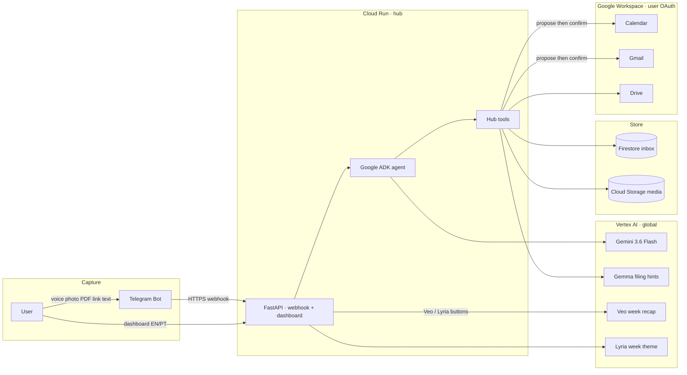

# Hub architecture

Personal multimodal organizer for the [All Things Agentic Hackathon](https://allthingsagentichackathon.devpost.com/) (Taskmaster track).

Capture chaos on Telegram → an ADK agent on Vertex Gemini classifies and files it → confirm Calendar / Gmail actions → review on a Cloud Run dashboard.

## Request path

1. Telegram delivers a message to `/telegram/webhook` on Cloud Run.
2. Hub creates (or reuses, after link dedupe) an `InboxItem` and runs an isolated ADK session `cap_{item_id}`.
3. The agent calls tools: `save_inbox_item`, `organize_item`, `save_financial_fact`, `propose_calendar_event`, `propose_email`, …
4. Sensitive side effects (Calendar create, Gmail send with CV) wait for Telegram inline confirmation.
5. The dashboard reads Firestore via `/api/inbox`, `/api/finance`, `/api/reports` and lets you edit status/folder.

## Storage

| What | Where |
|------|--------|
| Structured cards | Firestore `inbox` |
| Voice / photos / PDFs | GCS bucket |
| Local fallback | `data/inbox.json` when `HUB_USE_FIRESTORE=false` |
| OAuth token | Secret Manager → mounted at `/app/credentials/token.json` |

## Models

| Role | Model |
|------|--------|
| Main agent | `gemini-3.6-flash` (Vertex, location `global`) |
| Fast filing hint | Gemma (best-effort; skipped on 404) |
| Week video | Veo |
| Week audio theme | Lyria |
